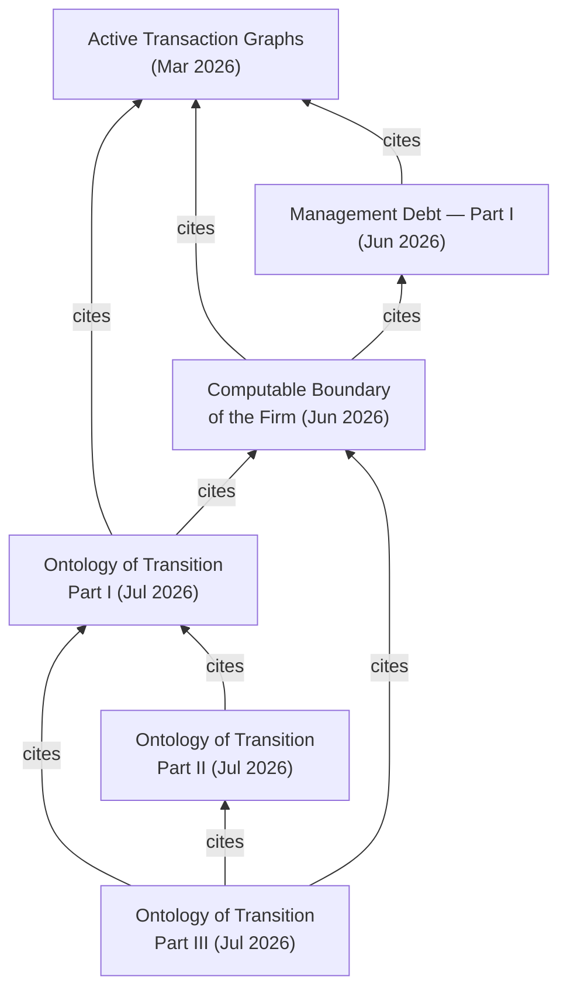

# Corezoid Research

Research papers by **[Alexander Vityaz](https://orcid.org/0009-0006-0489-7881)** (Corezoid Inc.) on the actor model, active transaction graphs, the computable theory of the firm, and the ontology of transition.

Every paper is published as an immutable, citable record on [Zenodo](https://zenodo.org/) (DOI per version); this repository is the curated home of the corpus — canonical PDFs, readable markdown versions, citation metadata, and cross-references between the papers.

> **How to read a paper here:** each paper lives in its own folder under [`papers/`](papers/) with a `README.md` (abstract, citation, links), the canonical `paper.pdf`, and a `paper.md` for reading on GitHub. Mathematical notation and figures are authoritative in the PDF and in the version of record on Zenodo.

## Papers

| # | Paper | Published | DOI | Formats |
|---|-------|-----------|-----|---------|
| 1 | [Active Transaction Graphs: A Formal Framework for Transactional Interactive Systems](papers/2026-active-transaction-graphs/) | Mar 2026 |  | [PDF](papers/2026-active-transaction-graphs/paper.pdf) · [MD](papers/2026-active-transaction-graphs/paper.md) |
| 2 | [The Computable Boundary of the Firm: Information Conditions for Viability and the Transactional Architecture of the Digital Twin](papers/2026-computable-boundary-of-the-firm/) | Jun 2026 |  | [PDF](papers/2026-computable-boundary-of-the-firm/paper.pdf) · [MD](papers/2026-computable-boundary-of-the-firm/paper.md) |
| 3 | [Management Debt — Part I: Concept, Metrics, and Principles for Attributing Materialised Debts to Actor Accounts](papers/2026-management-debt-part-i/) | Jun 2026 |  | [PDF](papers/2026-management-debt-part-i/paper.pdf) · [MD](papers/2026-management-debt-part-i/paper.md) |
| 4 | [Ontology of Transition: Causal Order, External Time, and the Thermodynamics of Physical Clock Records](papers/2026-ontology-of-transition/) *(three-part series + complete volume)* | Jul 2026 |  | [Volume PDF](papers/2026-ontology-of-transition/volume.pdf) · [Part I](papers/2026-ontology-of-transition/part-i/) · [Part II](papers/2026-ontology-of-transition/part-ii/) · [Part III](papers/2026-ontology-of-transition/part-iii/) |

### Ontology of Transition — parts

| Part | Title | DOI |
|------|-------|-----|
| I | [Causal Order of Events, Internal and External Clocks, Thermodynamics, and Information-Theoretic Distinguishability](papers/2026-ontology-of-transition/part-i/) |  |
| II | [The Unidentifiable Clock: Reconstruction Limits and Gauge Freedom of External Time under Lossy Delivery](papers/2026-ontology-of-transition/part-ii/) |  |
| III | [The Thermodynamic Price of External Time: Rate–Distortion Bounds for Physical Clock Records](papers/2026-ontology-of-transition/part-iii/) |  |

### External preprints

Earlier preprints by the same author, hosted on ResearchGate:

| Preprint | DOI | ResearchGate |
|----------|-----|--------------|
| On the Necessity of Noise Suppression for Minimal Good Regulators: Factorization Theorems and a Closure Conjecture (Jan 2026) | [10.13140/RG.2.2.33143.07843](https://doi.org/10.13140/RG.2.2.33143.07843) | [400615896](https://www.researchgate.net/publication/400615896) |
| Regulatory Quality of Asymptotic Models: A Quantitative Framework with Arithmetic Benchmark (2026) | [10.13140/RG.2.2.31082.79042](https://doi.org/10.13140/RG.2.2.31082.79042) | [402229391](https://www.researchgate.net/publication/402229391) |

<!-- TODO: PDFs of the two preprints above are only on ResearchGate (anonymous download blocked) —
     add author copies here as papers/ folders when available.
     Further 2026 publications by the author exist on ResearchGate and may belong in this index
     once PDFs/DOIs are confirmed: Company Brain (403449291), A Phase Model of Enterprise
     Evolution (403387171), What Is Work (403936327), Metaunderstanding (403758098),
     Beyond Programming Languages (410613460 — likely the EN version of the Substack essay). -->

### In preparation

Work in progress is reviewed privately in [`corezoid/research-drafts`](https://github.com/corezoid/research-drafts) and appears here on publication:

- **Management Debt — Part II**: account structure, double-entry attribution, platform implementation *(announced in Part I)*
- **The Actor Codex** — book, working draft *(Chapter X cited in The Computable Boundary of the Firm)*

## How the papers relate

*Active Transaction Graphs* is the foundational framework; the other papers build on its actor/graph/ledger semantics.

## How to cite

To cite an individual paper, use the `How to cite` section in that paper's `README.md` (each includes a formatted citation and a BibTeX entry with the paper's DOI). All BibTeX entries are also collected in [`bibliography.bib`](bibliography.bib).

To cite the collection as a whole, use the **"Cite this repository"** button on GitHub (backed by [`CITATION.cff`](CITATION.cff)).

## Publishing workflow

The full lifecycle — drafting, review, Zenodo DOI deposit, publication, versioning — is documented in [`PUBLISHING.md`](PUBLISHING.md).

## Roadmap

- [ ] Rendered reading site (Quarto + GitHub Pages) once the repository is public
- [ ] English/Ukrainian versions of the Russian-language works, with Zenodo DOIs
- [ ] Zenodo–GitHub release integration for collection snapshots

## License

- **Text, figures, and papers** (everything under `papers/`, all prose): [CC BY 4.0](LICENSE-CC-BY-4.0)
- **Code and scripts** (build tooling, CI): [Apache 2.0](LICENSE)
- **Bibliographic metadata** (`bibliography.bib`, `CITATION.cff`): public domain (CC0)

© Alexander Vityaz, Corezoid Inc.
