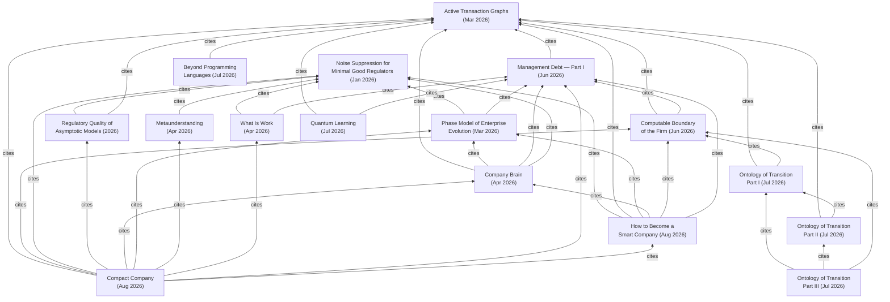

# Corezoid Research

Research papers by **[Alexander Vityaz](https://orcid.org/0009-0006-0489-7881)** (Corezoid Inc.) on the actor model, active transaction graphs, the computable theory of the firm, and the ontology of transition.

Every paper is published as an immutable, citable record on [Zenodo](https://zenodo.org/) (DOI per version); this repository is the curated home of the corpus — canonical PDFs, readable markdown versions, citation metadata, and cross-references between the papers.

> **How to read a paper here:** each paper lives in its own folder under [`papers/`](papers/) with a `README.md` (abstract, citation, links), the canonical `paper.pdf`, and a `paper.md` for reading on GitHub. Mathematical notation and figures are authoritative in the PDF and in the version of record on Zenodo.

## Papers

| # | Paper | Published | DOI | Formats |
|---|-------|-----------|-----|---------|
| 1 | [On the Necessity of Noise Suppression for Minimal Good Regulators: Factorization Theorems and a Closure Conjecture](papers/2026-noise-suppression-minimal-good-regulators/) | Jan 2026 |  | [PDF](papers/2026-noise-suppression-minimal-good-regulators/paper.pdf) |
| 2 | [Regulatory Quality of Asymptotic Models: A Quantitative Framework with Arithmetic Benchmark](papers/2026-regulatory-quality-asymptotic-models/) | 2026 |  | [PDF](papers/2026-regulatory-quality-asymptotic-models/paper.pdf) |
| 3 | [Active Transaction Graphs: A Formal Framework for Transactional Interactive Systems](papers/2026-active-transaction-graphs/) | Mar 2026 |  | [PDF](papers/2026-active-transaction-graphs/paper.pdf) · [MD](papers/2026-active-transaction-graphs/paper.md) |
| 4 | [A Phase Model of Enterprise Evolution: From Fragmentation to the Autonomous Enterprise](papers/2026-phase-model-of-enterprise-evolution/) | Mar 2026 |  | [PDF](papers/2026-phase-model-of-enterprise-evolution/paper.pdf) |
| 5 | [Company Brain: The Architecture of General Company Intelligence](papers/2026-company-brain/) | Apr 2026 |  | [PDF](papers/2026-company-brain/paper.pdf) |
| 6 | [What Is Work: The Law of Information Conservation and the AI Productivity Paradox in High-Context Knowledge Work](papers/2026-what-is-work/) | Apr 2026 | [RG 403936327](https://www.researchgate.net/publication/403936327) | [PDF](papers/2026-what-is-work/paper.pdf) |
| 7 | [Metaunderstanding: Recursive Compression, Tag Accounts, and Actor Graphs as the Next Layer of Mind in the Age of AI](papers/2026-metaunderstanding/) | Apr 2026 | [RG 403758098](https://www.researchgate.net/publication/403758098) | [PDF](papers/2026-metaunderstanding/paper.pdf) |
| 8 | [The Computable Boundary of the Firm: Information Conditions for Viability and the Transactional Architecture of the Digital Twin](papers/2026-computable-boundary-of-the-firm/) | Jun 2026 |  | [PDF](papers/2026-computable-boundary-of-the-firm/paper.pdf) · [MD](papers/2026-computable-boundary-of-the-firm/paper.md) |
| 9 | [Management Debt — Part I: Concept, Metrics, and Principles for Attributing Materialised Debts to Actor Accounts](papers/2026-management-debt-part-i/) | Jun 2026 |  | [PDF](papers/2026-management-debt-part-i/paper.pdf) · [MD](papers/2026-management-debt-part-i/paper.md) |
| 10 | [Ontology of Transition: Causal Order, External Time, and the Thermodynamics of Physical Clock Records](papers/2026-ontology-of-transition/) *(three-part series + complete volume)* | Jul 2026 |  | [Volume PDF](papers/2026-ontology-of-transition/volume.pdf) · [Part I](papers/2026-ontology-of-transition/part-i/) · [Part II](papers/2026-ontology-of-transition/part-ii/) · [Part III](papers/2026-ontology-of-transition/part-iii/) |
| 11 | [Beyond Programming Languages](papers/2026-beyond-programming-languages/) | Jul 2026 |  | [PDF](papers/2026-beyond-programming-languages/paper.pdf) |
| 12 | [Quantum Learning: From Educational Programs to Managing Changes in Human Capability](papers/2026-quantum-learning/) | Jul 2026 |  | [PDF](papers/2026-quantum-learning/paper.pdf) · [MD](papers/2026-quantum-learning/paper.md) |
| 13 | [The Compact Company: An Actor-Graph Theory of the Firm in the LLM Era](papers/2026-compact-company/) | Aug 2026 |  | [PDF](papers/2026-compact-company/paper.pdf) · [MD](papers/2026-compact-company/paper.md) |
| 14 | [How to Become a Smart Company](papers/2026-how-to-become-a-smart-company/) *(essay)* | Aug 2026 |  | [PDF](papers/2026-how-to-become-a-smart-company/paper.pdf) · [MD](papers/2026-how-to-become-a-smart-company/paper.md) |

### Ontology of Transition — parts

| Part | Title | DOI |
|------|-------|-----|
| I | [Causal Order of Events, Internal and External Clocks, Thermodynamics, and Information-Theoretic Distinguishability](papers/2026-ontology-of-transition/part-i/) |  |
| II | [The Unidentifiable Clock: Reconstruction Limits and Gauge Freedom of External Time under Lossy Delivery](papers/2026-ontology-of-transition/part-ii/) |  |
| III | [The Thermodynamic Price of External Time: Rate–Distortion Bounds for Physical Clock Records](papers/2026-ontology-of-transition/part-iii/) |  |

Papers with a `zenodo` DOI have Zenodo as the version of record; papers with an `RG.2.2` DOI (or an RG link) are preprints whose version of record is currently ResearchGate — Zenodo deposits for them are on the roadmap (see [PUBLISHING.md](PUBLISHING.md)).

### In preparation

Work in progress is reviewed privately and appears here on publication:

- **Management Debt — Part II**: account structure, double-entry attribution, platform implementation *(announced in Part I)*
- **The Actor Codex** — book, working draft *(Chapter X cited in The Computable Boundary of the Firm)*

## Patents

USPTO patents by the same author underpinning the Corezoid/Middleware platform; full texts are public records.

Earlier Ukrainian registrations — the PrivatBank-era inventions and utility models behind SMS one-time passwords, QR payments and card personalization — are indexed separately in [`patents/ua/`](patents/ua/).

| Patent | Title | Filed | Granted | Status | PDF |
|---|---|---|---|---|---|
| [US12657076B2](patents/US12657076-api-controlled-universal-computing-elements/) | System and method for processing data of any external services through API controlled universal computing elements *(continuation of US11941462)* | 2024-03-25 | 2026-06-16 | Active | [PDF](patents/US12657076-api-controlled-universal-computing-elements/patent.pdf) |
| [US11941462B2](patents/US11941462-api-controlled-universal-computing-elements/) | System and method for processing data of any external services through API controlled universal computing elements *(continuation of US11237835)* | 2021-07-29 | 2024-03-26 | Active | [PDF](patents/US11941462-api-controlled-universal-computing-elements/patent.pdf) |
| [US11237835B2](patents/US11237835-api-controlled-universal-computing-elements/) | System and method for processing data of any external services through API controlled universal computing elements | 2019-01-18 | 2022-02-01 | Active | [PDF](patents/US11237835-api-controlled-universal-computing-elements/patent.pdf) |
| [US11228570B2](patents/US11228570-safe-transfer-exchange-protocol/) | Safe-transfer exchange protocol based on trigger-ready envelopes among distributed nodes | 2019-03-01 | 2022-01-18 | Expired - Fee Related | [PDF](patents/US11228570-safe-transfer-exchange-protocol/patent.pdf) |
| [US11093935B2](patents/US11093935-resource-saving-exchange-protocol/) | System and methods for a resource-saving exchange protocol based on trigger-ready envelopes among distributed nodes | 2018-09-18 | 2021-08-17 | Active - Reinstated | [PDF](patents/US11093935-resource-saving-exchange-protocol/patent.pdf) |
| [US10776772B2](patents/US10776772-providing-or-sharing-access/) | Automated digital method and system of providing or sharing access | 2017-09-29 | 2020-09-15 | Active | [PDF](patents/US10776772-providing-or-sharing-access/patent.pdf) |
| [US10565302B2](patents/US10565302-dialog-with-fillable-forms/) | Method of organizing dialog with the use of fillable forms | 2019-02-21 | 2020-02-18 | Active | [PDF](patents/US10565302-dialog-with-fillable-forms/patent.pdf) |
| [US2024/0378338A1](patents/US20240378338-actor-graph-engine/) | Actor Graph Engine | 2023-05-08 | — (pending) | Pending | [PDF](patents/US20240378338-actor-graph-engine/patent.pdf) |
| [US2022/0100554A1](patents/US20220100554-modifying-data-processing-method/) | System and method for modifying a data processing method | 2021-09-22 | — (pending) | Pending | [PDF](patents/US20220100554-modifying-data-processing-method/patent.pdf) |
| [US2019/0007489A1](patents/US20190007489-condition-triggered-process/) | System and Methods for Running a Condition-Triggered Process Involving Movement of Objects from a Node to at least one other Node Until a Condition with a Set of Parameters Are Met By An Event | 2018-07-05 | — (pending) | Pending | [PDF](patents/US20190007489-condition-triggered-process/patent.pdf) |

## Interviews and public conversations

Public interviews and profiles documenting the development of ideas later formalized in the Corezoid Research corpus. They are context rather than contributions, and so sit outside the citation graph below.

[Browse the curated archive](interviews/)

## How the papers relate

Two papers anchor the corpus: *On the Necessity of Noise Suppression* (the cybernetic necessity result) and *Active Transaction Graphs* (the formal actor/graph/ledger framework); the other papers build on one or both.

## How to cite

To cite an individual paper, use the `How to cite` section in that paper's `README.md` (each includes a formatted citation and a BibTeX entry with the paper's DOI). All BibTeX entries are also collected in [`bibliography.bib`](bibliography.bib).

To cite the collection as a whole, use the **"Cite this repository"** button on GitHub (backed by [`CITATION.cff`](CITATION.cff)).

## Publishing workflow

The full lifecycle — drafting, review, Zenodo DOI deposit, publication, versioning — is documented in [`PUBLISHING.md`](PUBLISHING.md).

## Roadmap

- [ ] Rendered reading site (Quarto + GitHub Pages) once the repository is public
- [ ] Zenodo deposits (and DOIs) for the papers whose version of record is currently ResearchGate — first *What Is Work* and *Metaunderstanding*, which have no DOI at all
- [ ] Markdown reading versions for the PDF-only papers
- [ ] Zenodo–GitHub release integration for collection snapshots
- [ ] Ukrainian-language interviews: link Ukrainian originals as reading versions where no translation is needed

## License

- **Text, figures, and papers** (everything under `papers/`, all prose): [CC BY 4.0](LICENSE-CC-BY-4.0)
- **Code and scripts** (build tooling, CI): [Apache 2.0](LICENSE)
- **Bibliographic metadata** (`bibliography.bib`, `CITATION.cff`): public domain (CC0)
- **Third-party material**: US patent texts under `patents/` are public records of the USPTO. Interview originals linked from [`interviews/`](interviews/) remain © their publishing outlets; only the translations and editorial notes in that folder are covered by CC BY 4.0.

© Alexander Vityaz, Corezoid Inc.
