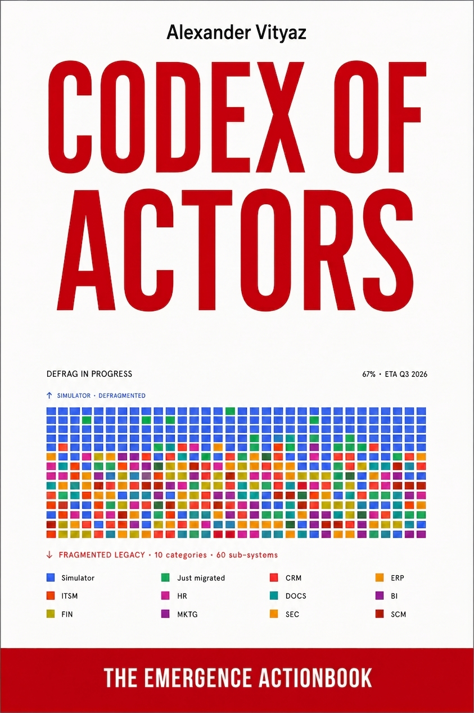

# Codex of Actors

A book by **[Alexander Vityaz](https://orcid.org/0009-0006-0489-7881)** (Corezoid Inc.), published
here **chapter by chapter** as the author releases them. Earlier corpus texts refer to it under
the working title *The Actor Codex*; a draft of its Chapter X, *The Boundaries of the Firm*, is
cited in [The Computable Boundary of the Firm](../papers/2026-computable-boundary-of-the-firm/).

The book synthesizes the research program collected in [`papers/`](../papers/) — the actor model,
Actor Graphs, active transaction graphs, and the computable theory of the firm — as a single
narrative. Chapters appear in this folder as they are published and may be revised until the book
is complete; the chapter table below is the authoritative index of what has been released.

## Chapters

| # | Chapter | What it covers | Released | Files |
|---|---------|----------------|----------|-------|
| 0 | Introduction: [Why Do You Need This Book?](chapter-00-why-do-you-need-this-book/chapter.md) | Introduces the register — the set of concepts and ways of reasoning available to a person or a company — and argues that AI, by adapting to the reader's register, masks the gap it should expose. Sets out the book's method: treating people, software and companies as actors, and complex systems as graphs of their interactions. | Sep 2026 | [chapter.md](chapter-00-why-do-you-need-this-book/chapter.md) (English translation) |

Each chapter lives in its own folder, `chapter-<NN>-<slug>/`, holding the canonical text as
supplied by the author (`chapter.pdf` and/or `chapter.md`).

## Status and citing

This is a work in progress: until the completed book (or an individual chapter) receives its own
DOI, cite chapters as *Vityaz, A. Codex of Actors, Chapter N (work in progress). In: Corezoid
Research repository* with a link to the chapter folder. The book sits outside the papers
citation graph; cross-references to and from the papers use "See also" links.

## License

Text and figures: [CC BY 4.0](../LICENSE-CC-BY-4.0), like the rest of the repository's text.
