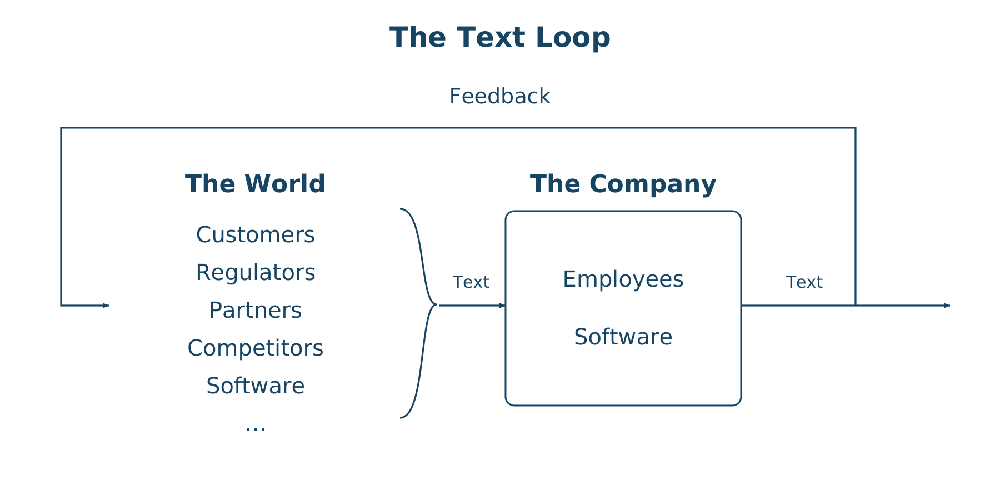
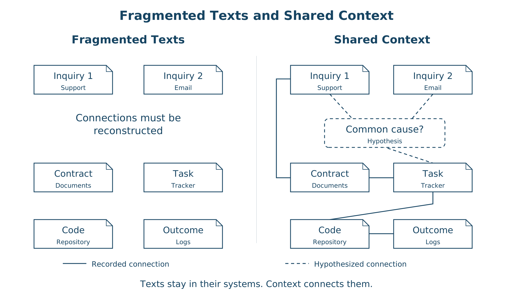
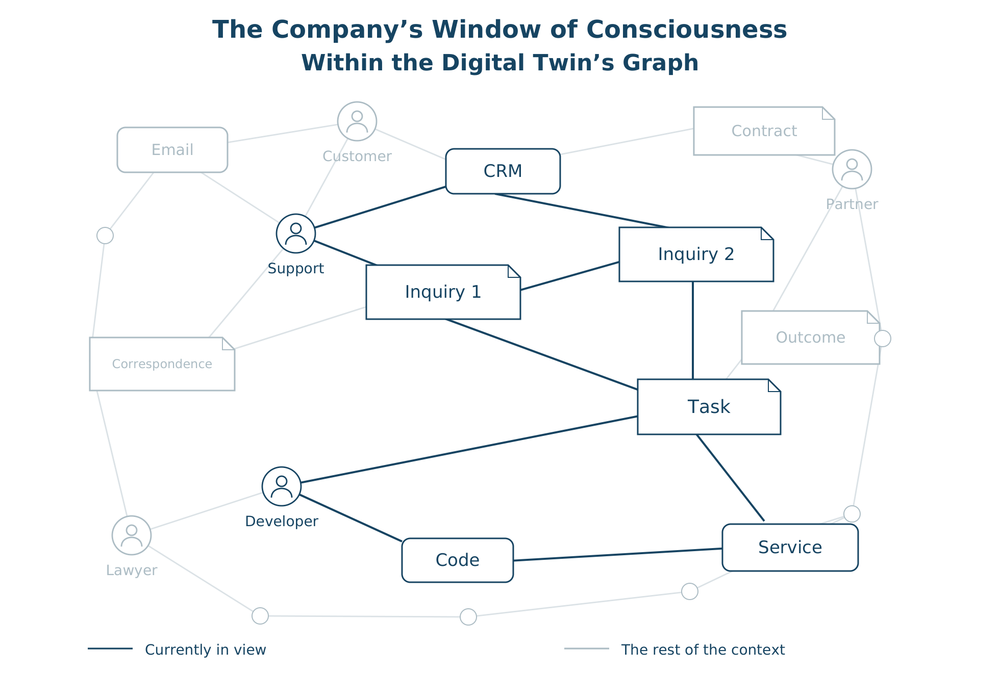
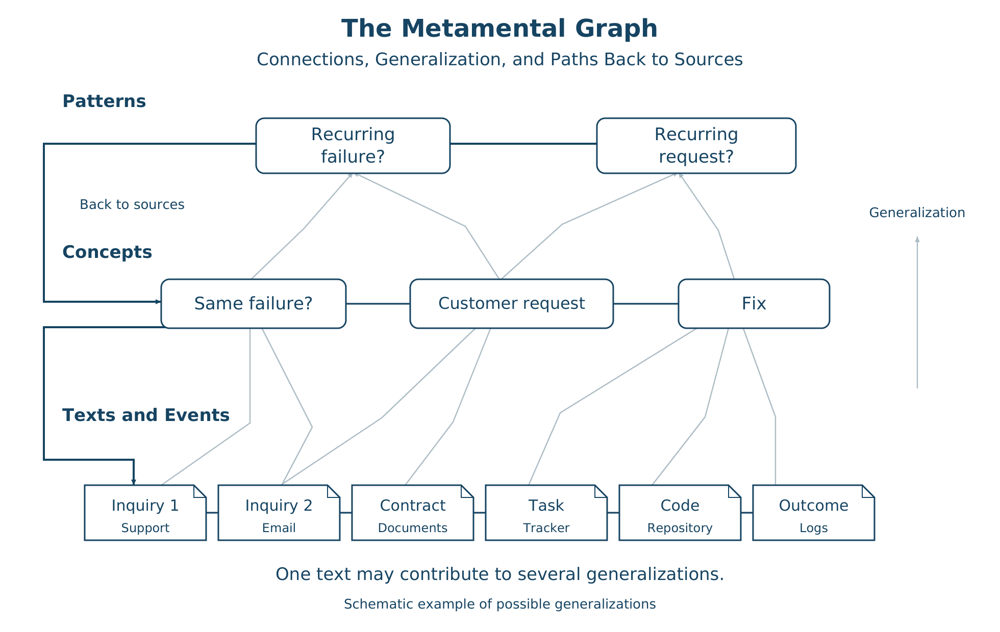

# THE COMPANY AS A TYPEWRITER

*"Everything I write is autobiography."*  
*Sergei Dovlatov*

## 1. The Company as a Text-Producing Machine

Every company is constantly writing and reading. Texts come in; new ones are created inside; old ones are revised or deleted; and more texts go out.

Everyone writes—from the security desk to the corner office, from the cash register to the ERP system. Business correspondence, presentations, meetings, code, directives, advertising, chats, calls, negotiations, registers, software logs, contracts, technical documentation—all are outputs of the company as a text-producing machine.

Throughout this chapter, "texts" means information in any form: written language, code, video, audio, images, and more (and, soon, thoughts).

Entire sectors of the economy consume and produce nothing but texts: Hollywood, publishing, music labels, IT companies, education, science, media, financial services, consulting, and law. Governments, too, are constantly writing something. Every AI company processes and generates texts—and does so on a planetary scale.

Sectors closely associated with text production, including financial services and public administration, account for roughly a third of global value added.[^1]

Even physical production depends on consuming and creating texts. Technical documentation, drawings, specifications, and software are prerequisites for manufacturing physical goods.

This gives us two types of companies: text companies and hybrid companies. For the first, text is the final product. The second produce texts alongside physical goods or services delivered in the physical world. Apple is a hybrid company: its computers, smartphones, and tablets sit alongside software, music, video, games, and books. Netflix and OpenAI are text companies.

In both types of companies, however, the texts they produce are fragmented. Different actors create them in different systems. Correspondence, documents, code, logs, and database records remain scattered fragments of the company's operations. The connections between them have yet to be brought together into a shared context.

The term "typewriter" keeps our attention on a concrete output of the company's work: the texts it produces. In the beginning was the Word [10]. In the end, too: whatever is produced, sold, or carried out becomes text again—a record, a report, a message.

Let's look at how this machine works. Texts arrive from customers, partners, regulators, and other external actors. Employees and software process them, create texts of their own, and pass the results along—within the company and beyond it.

The texts a company sends out bring new texts back in. An answer prompts another question; an offer leads to an order; fulfillment brings feedback or a complaint. The typewriter never clocks out.

This cycle is summarized in Figure 1.

*Figure 1: The company as a continuous text-processing loop.*

A company is also a reading machine. Employees and software read texts coming in from the outside world, interpret them, and put them to work. What they read becomes the raw material for new texts.

If a company produces texts, it faces some straightforward production questions. How many texts does it create each day, month, or year—and of what kinds? How many does it revise or delete? How is this volume measured and tracked? How is quality assessed? What management decisions are made on the strength of those records?

We need to track who created a text, what it refers to, which other texts it connects to, and what it changes in the company's operations.

A customer conversation, a contract, a developer's task, code changes, and a record of completed work may all be connected, yet sit in different applications and repositories. To understand what happened, someone has to piece the story back together.

Customers may describe the same failure in different words across separate inquiries. By connecting those inquiries to tasks and code changes, a company can connect the dots and uncover a common cause behind problems previously treated as unrelated.

Figure 2 illustrates how fragmented texts can be connected into a shared context.

*Figure 2: Connecting fragmented texts into a shared operational context.*

The connections between these fragments often live in employees' heads. When the next decision comes around, those connections have to be reconstructed all over again.

Bringing this context together and working with it in real time will help management see the bigger picture of what is happening inside the company and build a better regulator [7]—the mechanism that governs the company itself. A decision can then be traced back to the texts that prompted it, and its outcome linked to the decision.

In our company, support writes the most, followed by developers, legal, and business teams. With AI, they produce even more texts. Yet the human window of consciousness remains finite. As the volume of information grows, a smaller and smaller share fits inside it.

## 2. The Company's Window of Consciousness

**Definition 1 (Company's window of consciousness).** An Actor Graph [4] within the graph of the company's digital twin [8]. It represents the part of the company's operations and the outside world that employees and software can simultaneously hold in a shared context and take into account in their work.

The boundaries of this window are set by human attention, software capabilities, and the speed at which connections between incoming pieces of information are updated. A company may store vast amounts of information, yet at any given moment see and make sense of only a fraction of it.

Figure 3 situates this window within the company's digital twin.

*Figure 3: The company's window of consciousness within its digital twin.*

People, software, and texts are actors in a single graph.

At the same time, the number of possible connections between texts keeps growing. We have to consider both pairs of texts and the different sequences they can form. The complexity of checking every possibility can grow factorially. Without continuously uncovering and updating hidden connections, the context becomes increasingly fragmented.

Producing more texts does not, by itself, expand the company's window of consciousness. That requires uncovering connections and suppressing noise [5, 9]. Noise suppression condenses repetition and strips away irrelevant detail while preserving the distinctions that decisions depend on.

The task is this: digitize, track, and store every text the company receives and produces, then use AI to build and manage the company's context.

The first step is to bring texts together from different sources: email, chats, documents, software logs, and other systems. This is labor-intensive, but technically straightforward. As we collect each text, we must preserve its provenance and its connection to the actor that created it.

The second step is to discover and update connections between the collected texts. We call this structure the Big Book of Context, or BBC.

## 3. The Big Book of Context

**Definition 2 (Big Book of Context).** An Actor Graph that connects texts received and created by the company to their sources and to one another.

In Simulator, we are building it as a graph of ontologies and libraries, all the way down to atomic texts.

We already have Actor Graphs and actorization to support this. A text, a library, or an ontology is assigned an actor identity—an `actor_id`. Their relationships become explicit links in the graph. This makes it possible to move from a general concept to a library and then to a specific text, while preserving the connection to the source.

Some connections between texts are already recorded in software; others exist only in employees' understanding. AI helps uncover implicit connections in the content of texts and make them explicit in the BBC. The BBC's core task is to continuously extract hidden connections, building and updating the company's metamental knowledge graph.

## 4. The Metamental Graph

**Definition 3 (Metamental graph).** A shared, multilayered model of the company's knowledge. It connects the texts and mental representations of its participants to the concepts and patterns the company uses to understand situations and make decisions. Each successive level generalizes the one below it, preserving distinctions that matter for decisions and a path back to the original texts and events.

See also BANACH-2026 [1], §§1–2, and *Metaunderstanding* [6].

Figure 4 illustrates the layers and the paths back to source texts.

*Figure 4: A multilayered metamental graph linking source texts to higher-level concepts and patterns.*

By uncovering hidden connections and keeping them up to date, the BBC expands the company's window of consciousness. Software can maintain and update these connections, while a single pattern, once identified, makes it possible to take many individual cases into account at once.

The content of texts and the connections already known guide the search for combinations and the selection of those that matter. Exploring possible connections and selecting meaningful combinations is what it means to compute emergence: this is how we discover properties of a company that are invisible in isolated fragments of its operations.

In the next chapter, we will take a closer look at how a company's Big Book of Context is structured and how to work with it.

## References

1. Vityaz, A. (2026). *BANACH-2026: From Hierarchy to Egoism*. Zenodo. https://doi.org/10.5281/zenodo.22204469
2. PwC. (n.d.). *Value in Motion* [Interactive data explorer]. Global → Industries/Sectors, 2023. Accessed October 2, 2026. https://www.pwc.com/gx/en/issues/value-in-motion.html
3. PwC. (n.d.). *Value in Motion: Methodology*, pp. 29, 32. Accessed October 2, 2026. https://www.pwc.com/gx/en/issues/value-in-motion/value-in-motion-methodology.pdf
4. Vityaz, A. (2026). *Actor Graphs: Triple-Identity Accountable Mediation and Coinductive Disclosure: Identity-Faithful Representations, Transaction-Sourced Accounts, and a Presheaf Accountability Skeleton* [Preprint]. Zenodo. https://doi.org/10.5281/zenodo.21995981
5. Vityaz, A. (2026). *On the Necessity of Noise Suppression for Minimal Good Regulators: Factorization Theorems and a Closure Conjecture* [Preprint]. ResearchGate. https://doi.org/10.13140/RG.2.2.33143.07843
6. Vityaz, A. (2026). *Metaunderstanding: Recursive Compression, Tag Accounts, and Actor Graphs as the Next Layer of Mind in the Age of AI* [Preprint]. ResearchGate. https://www.researchgate.net/publication/403758098
7. Conant, R. C., & Ashby, W. R. (1970). Every good regulator of a system must be a model of that system. *International Journal of Systems Science, 1*(2), 89–97. https://doi.org/10.1080/00207727008920220
8. Vityaz, A. (2026). *How to Become a Smart Company*. Zenodo. https://doi.org/10.5281/zenodo.21792643
9. Vityaz, A. (2026, September 18). *You're Paying for Noise*. Corezoid. https://corezoid.com/blog/youre-paying-for-noise/
10. *The Holy Bible, King James Version*. John 1:1. Bible Gateway. https://www.biblegateway.com/passage/?search=John%201%3A1&version=KJV
11. Toner, J. (2014). *How to Manage Your Slaves by Marcus Sidonius Falx*. Profile Books.

[^1]: Author's calculation based on broad industry data from PwC's global model for 2023, at 2022 prices. Included sectors: information and communication (J); professional, scientific, and technical activities, and administrative and support services (MN); education (P); arts, entertainment, and recreation, other services, activities of households as employers and for their own use, and extraterritorial organizations (RSTU); financial and insurance activities (K); and public administration and defense, and compulsory social security (O). Using the rounded figures in the interactive: $33.82 trillion out of $105.28 trillion in global value added, or approximately 32%. This estimates the scale of related sectors, rather than precisely measuring text companies: it includes some non-text activity and does not isolate text work within hybrid companies. See [2, 3]; the methodology specifies units and prices on p. 29 and sector definitions on p. 32.

---

***Alexander Vityaz. Codex of Actors.***

*© 2026 Alexander Vityaz · Text licensed under CC BY 4.0*
