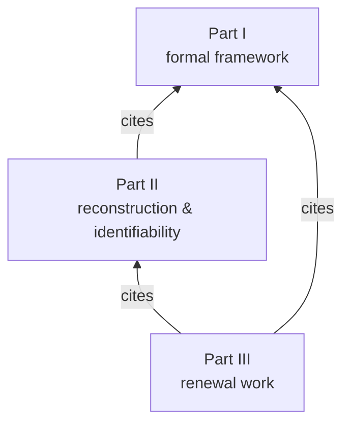

# Ontology of Transition: Causal Order, External Time, and the Thermodynamics of Physical Clock Records

[](https://doi.org/10.5281/zenodo.21380580)

**Alexander Vityaz** ([ORCID 0009-0006-0489-7881](https://orcid.org/0009-0006-0489-7881)) · Corezoid Inc., Dnipro, Ukraine
**Published:** July 2026 · **Version:** v1 · **License:** [CC BY 4.0](../../LICENSE-CC-BY-4.0)

> A three-part volume, published both as a complete volume and as three standalone citable parts, each with its own DOI.

## Abstract

This volume develops Ontology of Transition, a framework in which transition rather than the static thing is the primitive unit of description. The underlying structure is a locally finite partial order of events, with no continuous physical time assumed. Time is represented in two operationally distinct ways: a system's internal time accumulates as a functional of its own changes, whereas its accessible external time is reconstructed from a physical record of a selected clock process delivered through a communication channel. Because the channel admits noise, delay, loss, and aggregation, external time is relative, local, and partially observable; the continuous parameter *t* enters only as calibration and a refinement limit, not as a primitive. Thermodynamic balances are defined on an invariant energy skeleton of the history, making them independent of the arbitrary linearization of concurrent events, and a Separation Principle organizes time, work, entropy production, and information-theoretic distinguishability as distinct functionals of one causal carrier. Part I develops the formal framework and proves its invariance backbone (Proposition I.1 and Corollary I.1); Parts II and III supply the reconstruction, identifiability, and thermodynamic theorems enabled by that framework.

Part II proves the reconstruction and identifiability limits. For the erasure channel, the minimax error of reconstructing the source coordinate is exactly *n p σ²*, with perfect recoverability iff calibration is deterministic, and an additional counting floor when the tick count is unknown. Centrally, for the aggregating channel the pair (loss rate, calibration law) is never identifiable from the record law for any positive loss: it is determined only up to a one-parameter semigroup orbit of geometric compounding, containing at most one geometrically indecomposable representative — the rate of external time is gauge, and provenance metadata collapse the orbit. When the register output is a time-antisymmetric net current, it obeys a thermodynamic-uncertainty precision floor; objecthood also acquires a sharp critical loss rate *p_c* = (δ + ε)/(1 − δ − ε), set by the recognition scheme's tolerances δ and ε, above which fast object tokens dissolve while frozen ones persist at any loss.

Part III quantifies the work required for reuse. For a finite classical footprint reset isothermally without accessible side information, the average renewal work is bounded below by *k_B T* times the indirect rate–distortion function of the physical delivery channel — an indirect rate–distortion problem in the sense of Dobrushin–Tsybakov, Wolf–Ziv, and Witsenhausen. Closed forms are derived and shown exactly attainable; target distortions below the channel's Bayes risk are unattainable at any reset budget; and a sequential-ring corollary shows that renewal pays for the entropy of unpredictable innovations, not for the number of ticks. A three-floor synthesis proves the channel, register, and renewal budgets mutually irreducible: they constrain different observables through different mechanisms, and none implies another.

A recognition scheme operationalizes thinghood: physical objects appear as stable macroregimes (types) and individual realizations (tokens) that persist against the flow of transitions, with a sharp phase boundary for that persistence derived in Part II. The volume connects the event-ordering tradition of distributed systems, rate–distortion theory with its indirect branch, and stochastic thermodynamics in one formal language. All quantitative results are checked numerically; the closed forms agree with a Blahut–Arimoto solver to machine precision.

**Keywords:** process ontology; causal order; external time; physical clock records; stochastic thermodynamics; information-theoretic distinguishability; indirect rate-distortion theory; discrete-event systems; Landauer principle; gauge freedom of external time

## The three parts

| Part | Title | Published | DOI | Formats |
|------|-------|-----------|-----|---------|
| **I** | [Causal Order of Events, Internal and External Clocks, Thermodynamics, and Information-Theoretic Distinguishability](part-i/) | 2026-07-21 | [](https://doi.org/10.5281/zenodo.21471785) | [PDF](part-i/paper.pdf) · [MD](part-i/paper.md) |
| **II** | [The Unidentifiable Clock: Reconstruction Limits and Gauge Freedom of External Time under Lossy Delivery](part-ii/) | 2026-07-21 | [](https://doi.org/10.5281/zenodo.21472271) | [PDF](part-ii/paper.pdf) · [MD](part-ii/paper.md) |
| **III** | [The Thermodynamic Price of External Time: Rate–Distortion Bounds for Physical Clock Records](part-iii/) | 2026-07-21 | [](https://doi.org/10.5281/zenodo.21473025) | [PDF](part-iii/paper.pdf) · [MD](part-iii/paper.md) |

**Part I** develops the formal framework — causal order, internal and external clocks, the delivery channel, the energy skeleton, the Separation Principle, and the recognition scheme — and proves its invariance backbone. **Part II** turns that architecture into reconstruction and identifiability theorems, including the gauge freedom of external time and the critical loss rate for objecthood. **Part III** prices reuse: how much reusable physical memory, and therefore how much ideal reset work, is required to realize the external-time functional at a chosen accuracy.



## Citation guidance

This volume is also published as three standalone citable parts, each with its own DOI.

> Vityaz, A. (2026). *Ontology of Transition—Part I: Causal Order of Events, Internal and External Clocks, Thermodynamics, and Information-Theoretic Distinguishability*. Zenodo. https://doi.org/10.5281/zenodo.21471785

> Vityaz, A. (2026). *Ontology of Transition—Part II: The Unidentifiable Clock: Reconstruction Limits and Gauge Freedom of External Time under Lossy Delivery*. Zenodo. https://doi.org/10.5281/zenodo.21472271

> Vityaz, A. (2026). *Ontology of Transition—Part III: The Thermodynamic Price of External Time: Rate–Distortion Bounds for Physical Clock Records*. Zenodo. https://doi.org/10.5281/zenodo.21473025

Please cite the relevant standalone part when referring to a specific definition, theorem, proof, numerical result, or application. Cite the complete-volume DOI when referring to the architecture and conclusions of the three-part work as a whole.

## Files

| File | Description |
|------|-------------|
| [volume.pdf](volume.pdf) | Canonical PDF of the complete three-part volume (identical to the Zenodo deposit) |
| [part-i/](part-i/) | Part I — PDF, markdown, README, changelog |
| [part-ii/](part-ii/) | Part II — PDF, markdown, README, changelog |
| [part-iii/](part-iii/) | Part III — PDF, markdown, README, changelog |

The volume PDF is the authoritative record for the work as a whole. Its text is the concatenation of the three parts, so no separate markdown version of the volume is kept here — read the parts' `paper.md` files instead.

## How to cite

To cite the volume as a whole:

> Vityaz, A. (2026). *Ontology of Transition: Causal Order, External Time, and the Thermodynamics of Physical Clock Records*. Zenodo. https://doi.org/10.5281/zenodo.21380580

```bibtex
@misc{vityaz2026ontology,
  author       = {Vityaz, Alexander},
  title        = {Ontology of Transition: Causal Order, External Time, and the Thermodynamics of Physical Clock Records},
  year         = {2026},
  month        = jul,
  publisher    = {Zenodo},
  doi          = {10.5281/zenodo.21380580},
  url          = {https://doi.org/10.5281/zenodo.21380580},
  note         = {Complete three-part volume}
}
```

Per the citation guidance above, cite the individual part (`vityaz2026ontology1`, `vityaz2026ontology2`, `vityaz2026ontology3` in [`bibliography.bib`](../../bibliography.bib)) wherever you refer to a specific definition, theorem, proof, or numerical result rather than to the work as a whole.

## Related work in this repository

- **Builds on** [Active Transaction Graphs](../2026-active-transaction-graphs/) — the foundational framework of the corpus; cited directly by Part I for mediated interaction, execution traces, and observational metadata.
- **Builds on** [The Computable Boundary of the Firm](../2026-computable-boundary-of-the-firm/) — cited by Parts I and III for the treatment of the system boundary as an explicit information-bearing object of control, which Part III's reset-work attribution requires.

## Links

- Version of record (complete volume): https://doi.org/10.5281/zenodo.21380580
- Standalone parts: [Part I](https://doi.org/10.5281/zenodo.21471785) · [Part II](https://doi.org/10.5281/zenodo.21472271) · [Part III](https://doi.org/10.5281/zenodo.21473025)

## Changelog

See [CHANGELOG.md](CHANGELOG.md).
